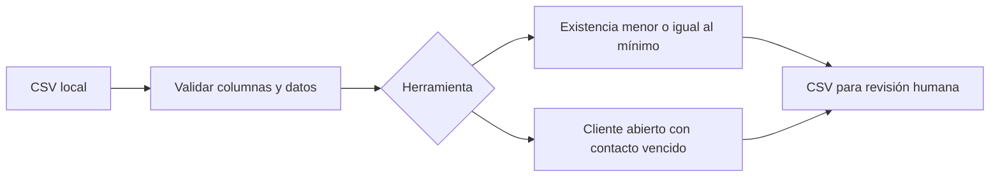

# Dos herramientas pequeñas para tu negocio

**Adaptación básica: US$5 por herramienta; US$9 por ambas.** Primero acordamos por correo un formato de entrada, el resultado esperado y la fecha. Incluye instrucciones y una corrección dentro del alcance. Pide presupuesto a [pruebasprofix@gmail.com](mailto:pruebasprofix@gmail.com?subject=Kit%20operaciones). No hay compra automática ni pago comprometido al escribir.

## Tiendas: lista de reposición

Edita `inventario.csv` con tus productos. El reporte selecciona existencia menor o igual al mínimo y sugiere objetivo menos existencia. Tú defines los umbrales; no predice ventas ni realiza pedidos.

```sh
python operaciones.py inventario inventario.csv reponer.csv
```

## Servicios y ventas: seguimientos pendientes

Edita `seguimiento.csv`. El reporte incluye clientes abiertos cuya próxima fecha de contacto sea hoy o anterior. Las fechas usan YYYY-MM-DD y los estados son abierto, ganado y perdido. La fecha es obligatoria en todas las filas. No envía mensajes a nadie.

```sh
python operaciones.py seguimiento seguimiento.csv pendientes.csv --hoy 2026-09-12
```

Omite `--hoy` para usar la fecha local. El ejemplo fechado es ficticio. No subas información de clientes al repositorio: trabaja localmente y comparte solo muestras anonimizadas para solicitar cambios.

## Requisitos y límites

Python 3.10 o posterior. Sin dependencias, API ni servicios pagados. CSV UTF-8 con coma y columnas en el orden del ejemplo; exporta desde Excel como CSV. No lee XLSX ni sincroniza Google Sheets. Identificadores únicos; cantidades decimales con punto, no negativas; objetivo mayor o igual al mínimo. Rechaza destinos existentes y conserva el archivo original. Carga los resultados en memoria. Protege textos exportados que empiezan por =, +, - o @ con un apóstrofo para reducir ejecución de fórmulas en hojas de cálculo.

El código y los formatos son gratuitos; el precio corresponde a la adaptación acordada, no al acceso a estos archivos. Se permite usar, copiar, modificar y distribuir el código sin garantía. Desarrollo asistido por IA, operado por @pruebasprofix-glitch. No hay ventas verificadas. Pruebas: `python -m unittest discover -s .` desde esta carpeta.


